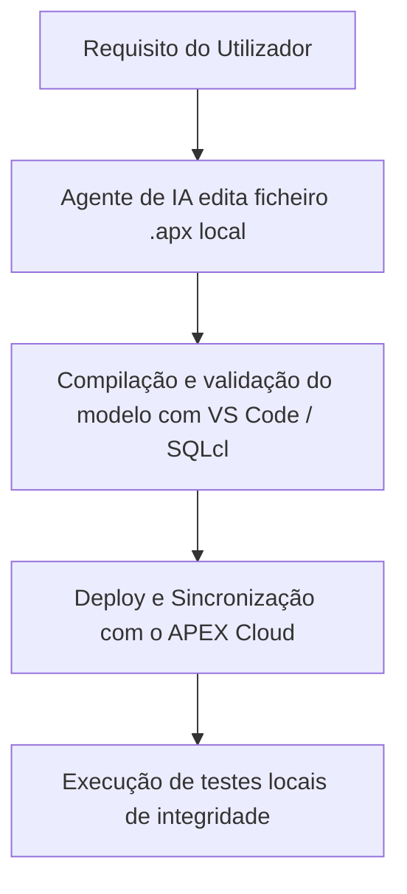

# Estratégia de Desenvolvimento e Deploy com APEXlang (SGUF v9)

## 1. Visão Geral
Esta estratégia define o fluxo de trabalho para permitir que agentes de IA (como **Antigravity** ou **OpenCode**) implementem, alterem e façam deploy da aplicação **Oracle APEX (SGUF v9)**. O pilar central é o **APEXlang** (a especificação declarativa em ficheiros de texto `.apx`), eliminando a necessidade de navegação visual (cliques no browser) para a maior parte das tarefas de desenvolvimento.

---

## 2. Fluxo de Trabalho do Agente de IA

O ciclo de desenvolvimento segue uma abordagem *Code-First* baseada em repositório:

### Passo 1: Edição e Geração Local (`.apx`)
O agente edita os ficheiros `.apx` estruturados em formato de texto para gerir:
- Propriedades de páginas (regiões, botões, itens de formulário).
- Mapeamento de Lists of Values (LOVs) e Shared Components.
- Ações dinâmicas e ligações a processos PL/SQL.

### Passo 2: Sincronização e Deploy
O deploy e compilação no ambiente Oracle APEX online são executados via ferramentas de linha de comando:
- **SQLcl (Oracle SQL Command Line):** Utilizado para importar/exportar a especificação declarativa de forma automática.
- **Oracle VS Code Extension Sync:** O processo de sincronização local que compila e publica no workspace associado à nossa conta.

---

## 3. Planeamento da Infraestrutura SGUF v9

Para iniciar a fase de planeamento e atualização utilizando APEXlang, dividiremos a implementação nas seguintes etapas técnicas:

### Módulo 1: Fundação & Mapeamento Inicial (.apx)
- **Foco:** Configuração base da App SGUF v9 no repositório.
- **Entregáveis:** 
  - Ficheiro de especificação da App principal (`app.apx`).
  - Mapeamento das LOVs globais a partir do script `01_lookup_tables.sql`.

### Módulo 2: Páginas de Gestão de Candidatos e Entidades
- **Foco:** Ecrãs criados via código declarativo.
- **Entregáveis:**
  - Definição da Página de Triagem (`p2_triagem.apx`) integrando a UX Híbrida (Semáforos NIF/Género).
  - Ligação ao pacote PL/SQL `PKG_MATRICULAS`.

### Módulo 3: Automatizações e Integrações
- **Foco:** Acoplamento de UI aos serviços de backend da BD.
- **Entregáveis:**
  - Ecrãs de gestão de filas de e-mail e templates (`p5_mailing.apx`).
  - Scripts de automação vinculados ao `PKG_COMUNICACAO`.

---

## 4. Próximos Passos de Execução
1. **Configuração de Workspace Local:** Validar a diretoria padrão dos ficheiros `.apx` da aplicação SGUF v9.
2. **Setup do SQLcl / Sync:** Confirmar parâmetros de ligação da conta APEX ativa para validação de comandos de compilação automáticos.
3. **Escrita da App Base:** O agente de IA gerará o esqueleto inicial em APEXlang.
