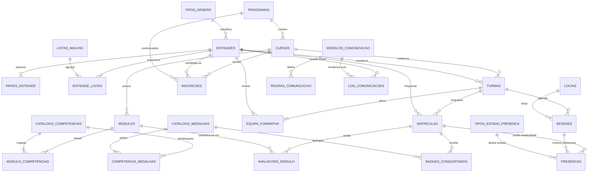

# Diagrama Entidade-Relação (ERD) Completo: SGUF v9

Este documento contém o diagrama das tabelas do modelo de dados **SGUF v9** e as suas relações.

```mermaid
erDiagram
    PROGRAMAS ||--o{ CURSOS : "contem"
    CURSOS ||--o{ MODULOS : "possui"
    MODULOS ||--|{ MODULO_COMPETENCIAS : "requer"
    CATALOGO_COMPETENCIAS ||--|{ MODULO_COMPETENCIAS : "mapeia"
    CATALOGO_COMPETENCIAS ||--|{ COMPETENCIA_MEDALHAS : "desbloqueia"
    CATALOGO_MEDALHAS ||--|{ COMPETENCIA_MEDALHAS : "atribui"
    TIPOS_GENERO ||--o{ ENTIDADES : "classifica"
    ENTIDADES ||--|{ PAPEIS_ENTIDADE : "assume"
    ENTIDADES ||--|{ ENTIDADE_LISTAS : "subscreve"
    LISTAS_MAILING ||--|{ ENTIDADE_LISTAS : "agrupa"
    CURSOS ||--o{ TURMAS : "instancia"
    ENTIDADES ||--o{ TURMAS : "coordena"
    TURMAS ||--|{ EQUIPA_FORMATIVA : "aloca"
    ENTIDADES ||--|{ EQUIPA_FORMATIVA : "ensina"
    CURSOS ||--o{ INSCRICOES : "recebe"
    ENTIDADES ||--o{ INSCRICOES : "candidata-se"
    PROGRAMAS ||--o{ INSCRICOES : "contextualiza"
    TURMAS ||--o{ MATRICULAS : "enquadra"
    ENTIDADES ||--o{ MATRICULAS : "frequenta"
    TURMAS ||--o{ SESSOES : "agenda"
    LOCAIS ||--o{ SESSOES : "aloja"
    MATRICULAS ||--o{ PRESENCAS : "avalia-assiduidade"
    SESSOES ||--o{ PRESENCAS : "contem-presencas"
    TIPOS_ESTADO_PRESENCA ||--o{ PRESENCAS : "atribui-estado"
    MATRICULAS ||--o{ AVALIACOES_MODULO : "avalia"
    MODULOS ||--o{ AVALIACOES_MODULO : "classifica-se-em"
    MATRICULAS ||--o{ BADGES_CONQUISTADOS : "recebe"
    CATALOGO_MEDALHAS ||--o{ BADGES_CONQUISTADOS : "distingue"
    MODELOS_COMUNICACAO ||--o{ REGRAS_COMUNICACAO : "define"
    ENTIDADES ||--o{ LOG_COMUNICACOES : "recebe-email"
    MODELOS_COMUNICACAO ||--o{ LOG_COMUNICACOES : "renderiza-com"
```

